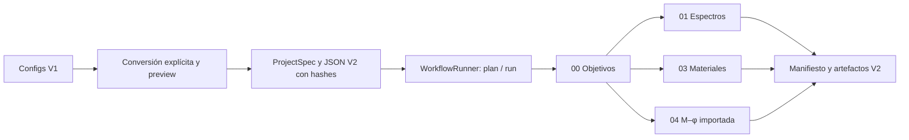

# Arquitectura V2 y estado de implementación

La arquitectura PBSD/PBEE conserva trece módulos visibles, 00–12. El identificador que se usa en contratos y CLI es `module_id`; los números son una guía del proceso y **no reinterpretan** `stage_01`, `stage_02` ni `stage_03` de V1. El catálogo y el DAG existen para todos los módulos, pero tener una entrada en el catálogo no significa tener un handler científico.

| Nº | `module_id` | Responsabilidad | Estado ejecutable actual |
|---|---|---|---|
| 00 | `project_objectives` | Identidad, sitio, objetivos y referencias del proyecto | **Operativo:** valida y publica `ProjectSpec`; no decide criterios de desempeño por sí mismo |
| 01 | `site_hazard` | Sitio y amenaza sísmica | **Operativo parcialmente:** espectros NSR-10 y forma CCP-14 con valores SGC configurados; sin importador probabilístico OpenQuake/SGC ni curvas de tasa de excedencia |
| 02 | `baseline_model` | Modelo estructural base | **Pendiente:** no importa ni verifica una edificación |
| 03 | `material_characterization` | Materiales constitutivos | **Operativo parcialmente:** cuatro formulaciones actuales y un conjunto de materiales por configuración; sin múltiples `material_set_id` ni asignación a un modelo global |
| 04 | `section_component_characterization` | Secciones y componentes | **Operativo parcialmente:** importación de curvas M–φ Excel e idealización; sin motor nativo de fibras ni modelo de componentes |
| 05 | `ground_motion` | Definición de movimientos | **Pendiente:** Target Spectrum, External Record Acquisition, Amplitude Scaling, optional External Spectral Matching y Suite QA son la división prevista, aún sin handlers |
| 06 | `nonlinear_model` | Ensamblaje no lineal y QA | **Pendiente:** representación neutral respecto al solver y adaptadores ETABS, Perform-3D u OpenSees |
| 07 | `nonlinear_analysis` | Análisis no lineal | **Pendiente:** sin backend ni ejecución estructural |
| 08 | `demand_performance` | Demandas y aceptación | **Pendiente:** sin EDP ni comprobaciones de desempeño |
| 09 | `collapse_fragility` | Colapso y fragilidad | **Pendiente** |
| 10 | `damage_loss` | Daño y pérdidas | **Pendiente** |
| 11 | `seismic_risk` | Riesgo sísmico | **Pendiente:** los espectros actuales no son una curva probabilística de amenaza |
| 12 | `reporting_iteration` | Reporte e iteración | **Pendiente:** existen tablas/figuras/reportes V1 por dominio, pero no un handler integral; el motor definitivo PDF/HTML se decidirá aquí |

`plan` informa `not_implemented` cuando falta un handler y `blocked` cuando una dependencia requerida no puede ejecutarse. Nunca comunica que un módulo futuro haya completado un análisis. Los módulos 01, 03 y 04 pueden caracterizar sus datos existentes de manera independiente porque solo requieren 00 en el DAG actual. La importación M–φ no demuestra una relación física con las curvas constitutivas del ejemplo; la conversión conjunta V1→V2 exige que quien prepara el proyecto confirme esa asociación. Para construir y analizar una edificación se requerirán las dependencias de 02, 05 y 06–08, según el método.

## Flujo que existe hoy

`contracts/` define proyecto, resultados, artefactos, procedencia y fronteras de unidades/signos. `workflow/` contiene catálogo, contexto, DAG, planificación, handlers y reutilización. `services/` prepara los cálculos existentes en memoria; `mechanics/` conserva formulaciones; `presentation/` produce tablas y figuras; `io/artifacts.py` publica cada corrida V2 de forma aislada. La CLI únicamente carga contratos y llama a `WorkflowRunner`. Los comandos V1 conservan sus rutas, significado y publicación históricos.

Un resultado `completed` expresa éxito de ejecución, no aceptación de desempeño. `numerical_quality`, `applicability`, warnings y `performance_acceptance` se registran aparte. La salida de secciones llamada `ciclica` sigue siendo una envolvente recortada o reutilizada, no una ley histerética. El ejemplo `Cyc_MP` conserva su etiqueta de parámetros sintéticos. Las conversiones de unidades y signos se declaran en fronteras; no se reescribieron los datos V1.

## Identidad, entradas y publicación

Una corrida identifica `project_id`, `design_revision`, `case_id` y `run_id`. `ProjectSpec` contiene sitio, unidades base, niveles de amenaza, objetivos y referencias con SHA-256. El conversor exige datos explícitos que V1 no puede inferir, guarda la procedencia de cada input y nunca migra los `outputs/stage_0x` como si fueran fixtures. `plan` verifica referencias y puede mostrar `ready`, `reusable`, `invalidated`, `not_implemented` o `blocked` con razones. `run` utiliza únicamente handlers registrados y publica bajo `outputs/v2/<project>/<revision>/<case>/<run>/` (o una raíz indicada con `--output-root`), con manifiesto final. La reutilización requiere un manifiesto previo indicado expresamente y pasa verificaciones de hash, dependencias y calidad.

El TXT ETABS actual es solo un exportador de espectros. No existe conexión a la API de ETABS ni un backend de análisis. `references/` sigue siendo la biblioteca científica; su [catálogo](../references/catalog.yaml) registra hashes y alias binarios, sin afirmar que cada PDF esté bibliográficamente validado. Las fuentes no se reorganizaron en este cierre.

La [guía de migración](migration/COMPATIBILITY_CLI_V2_023_025.md) describe el formato de conversión y los comandos. La [memoria de cierre](migration/V2_MIGRATION_CLOSURE.md) reúne verificación y deuda técnica. El [plan original](MIGRATION_PLAN_V2.md) mantiene el backlog de capacidades futuras; sus secciones de «estado actual» son una fotografía de la revisión inicial, anterior a los handlers V2.
