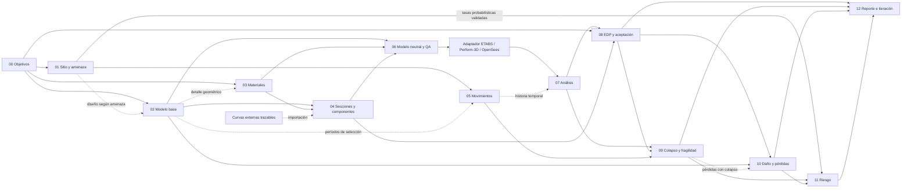

# Plan de migración V2 — orquestador PBSD/PBEE

**Estado: decisiones de arquitectura incorporadas; migración de código pendiente.**  
**Fecha de revisión:** 25 de septiembre de 2026.  
**Alcance hasta esta entrega:** V2-001 a V2-009 y la Issue independiente [V2-003R — Remove Quarto reporting dependency](migration/REMOVE_QUARTO_REPORTING_DEPENDENCY.md); V2-010 y posteriores siguen pendientes. No se movieron fuentes ni módulos científicos.

La propuesta conserva los núcleos numéricos existentes y los integra gradualmente en un flujo de proyecto reproducible. La numeración 00–12 describe responsabilidades del proceso; la identidad interna de cada módulo debe ser semántica y estable. Renombrar las tres etapas actuales no basta para implementar PBSD/PBEE.

## Decisiones incorporadas

El acta de las decisiones aprobadas y el estado de las tareas V2-001 a V2-003 se encuentran en [Estado de línea base V2](migration/BASELINE_STATUS_V2.md). Las decisiones aún abiertas permanecen identificadas allí y no bloquean la caracterización V1.

Se mantienen las trece etapas 00–12 y sus IDs semánticos. El módulo 04 tendrá un motor nativo de secciones por fibras; la importación de curvas Excel permanecerá como entrada de compatibilidad y fuente de comparación, con procedencia y condiciones de equivalencia explícitas. El módulo 05 comprende cinco funciones: **Target Spectrum**, **External Record Acquisition**, **Amplitude Scaling**, **optional External Spectral Matching** y **Suite QA**. El módulo 06 produce primero una representación no lineal neutral respecto al solver y solo después la traduce mediante adaptadores de ETABS, Perform-3D u OpenSees. El módulo 01 separa espectros normativos de resultados probabilísticos importados de OpenQuake/SGC. `references/` conserva su función de biblioteca científica: `references/catalog.yaml` se crea antes de cualquier reorganización física.

Estas decisiones fijan el destino arquitectónico; no afirman que las nuevas capacidades ya existan ni seleccionan un backend, proveedor de registros o formulación de concreto no confinado.

## Base de la revisión y estado actual

Se revisaron la estructura, interfaces, dependencias y responsabilidades de `src/`, los siete archivos de configuración, los 14 archivos de tests, los Markdown y fuentes HTML de `docs/`, el inventario de referencias y los puntos de entrada. También se consultaron `README.md`, `pyproject.toml`, `.gitignore` y los scripts de ejecución y entorno.

- En la revisión inicial no existía `AGENTS.md` en la raíz ni en los directorios superiores revisados o dentro del repositorio. Se incorpora ahora en la raíz con las decisiones y límites de trabajo vigentes.
- `src/` contiene 70 archivos Python y aproximadamente 10 121 líneas, incluidos inicializadores. Los tests contienen aproximadamente 2 276 líneas.
- Hay cinco Markdown previos en `docs/`, tres guías HTML con sus PDF y tres imágenes. Se revisaron las fuentes textuales de las guías; no se realizó auditoría visual de los PDF.
- `references/` contiene 23 PDF, dos XLSX y notas de procedencia. Se inventariaron rutas, usos y duplicados por SHA-256 y se crea `references/catalog.yaml` con las rutas y hashes actuales. Se inspeccionó la estructura interna de ambos XLSX. No se revalidó el contenido científico de cada PDF ni la vigencia de sus fuentes; este es un plan de arquitectura y migración, no una certificación de formulaciones.
- La referencia local de `main` leída en `.git/refs/heads/main` es `1d1490e17a8cbcd1ee65e3d78d989e19bae7a18f`. `git` no está disponible en el PATH de esta sesión; esa referencia no demuestra que el árbol de trabajo coincida con el commit. Debe congelarse el árbol efectivo antes de migrar.

### Evidencia funcional

| Área | Implementación comprobada | Límite actual |
|---|---|---|
| Amenaza | `design/stages/stage_01_hazard.py`, `mechanics/hazard/seismic/spectra.py`; casos NSR-10 y SGC + CCP-14 | Espectros normativos/formas de código que usan parámetros configurados, incluidos valores SGC en el segundo caso; no hay importador de salidas probabilísticas OpenQuake/SGC ni curva de tasas de excedencia utilizable directamente para riesgo |
| Materiales | `stage_02_material_characterization.py`, `stage_02_input_config.py` y cuatro formulaciones | Caracterización constitutiva; no hay ensamblador global ni conexión a un solver |
| Secciones | `stage_03_section_characterization.py`, `mechanics/sections/moment_curvature.py` | Importa curvas M–φ de Excel y las idealiza; el motor nativo de secciones por fibras es trabajo nuevo de V2 |
| Idealización | `mechanics/idealization/energy_equivalent.py` | Motor compartido por secciones y Mon_MRO; trabaja con envolventes de magnitudes positivas |
| Reportes | Matplotlib, CSV/XLSX, YAML/JSON; materiales PDF de Matplotlib; amenaza conserva YAML y figuras | Stage 01 ya no invoca Quarto/Typst ni genera nuevos QMD/PDF; `reports/report_builder.py` es un stub |
| Integración ETABS | `io/etabs.py` exporta espectros TXT sin encabezado | No importa modelos, no usa la API de ETABS y no ejecuta análisis |
| Infraestructura | Helpers de unidades, validación, rutas y registro | No hay contratos versionados, DAG de ejecución, manifiesto de corrida ni seguimiento de dependencias |

**No están implementados** los módulos 00 y 02 de la arquitectura nueva ni 05–11. El módulo 12 tiene utilidades aprovechables, pero no un reporte integral ni gestión de iteraciones. Las carpetas de concreto no confinado y algunas ramas cíclicas son reservas de estructura, no capacidades operativas.

### Hallazgos que condicionan la migración

1. **La numeración colisiona:** el `stage_02` actual significa materiales, mientras V2 02 significa modelo estructural base; el `stage_03` actual significa secciones, mientras V2 03 significa materiales. Los identificadores aparecen en código, imports, configuraciones, documentación, artefactos y tests.
2. **No existe una cadena automática amenaza → materiales → secciones.** Son ejecuciones independientes. La sección se alimenta de Excel, no de las curvas de materiales. Los cuatro materiales del ejemplo comparten identificadores, pero ello no demuestra que estén asignados a una misma edificación o sección del libro M–φ.
3. **Materiales mezcla responsabilidades.** Su workflow tiene 1 419 líneas: selección de modelos, generación de historias, métricas, idealización, texto técnico, etiquetas, gráficos y publicación de resultados. Secciones tiene 856 líneas; amenaza 742; `reports/plots.py` 1 206.
4. **Publicación heterogénea:** amenaza borra el caso activo y carpetas heredadas de nivel etapa; materiales calcula y escribe en un temporal, respalda y reemplaza todo `outputs/stage_02`; secciones borra todo su árbol antes de procesar las curvas. La transacción de materiales es una base útil, pero no garantiza aislamiento por caso ni tolerancia completa a interrupciones o concurrencia.
5. **Diferencias entre documentos y código:** README y `docs/material_characterization.md` presentan `Modelos_constitutivos/COL75X75FC28MPa` como exigencia. El cargador exige un único par compartido y nombres válidos, pero no fija esos dos literales. Guías HTML describen reemplazo por caso, mientras el código reemplaza toda Stage 02; la guía Mon_MRO muestra comportamiento/material en orden contrario a la ruta efectiva material/comportamiento.
6. **Convenciones distintas:** Mander exporta compresión positiva y tracción negativa; el acero exporta tracción positiva y compresión negativa. `RectangularSection` usa cm; materiales mm y MPa; secciones kN-m y 1/m; amenaza g y s. `core/units.py` no implementa un sistema dimensional general.
7. **La carpeta `ciclica/` de secciones contiene una envolvente:** con corte explícito se recalcula la bilineal; sin corte efectivo se reutiliza el resultado monotónico. El flujo genera esas salidas incluso cuando no hay corte habilitado. No representa memoria, disipación por ciclos ni reglas de descarga y recarga.
8. **Estados insuficientes:** una bilinealización `best_effort` puede coexistir con un resultado de etapa `completed`. Deben distinguirse éxito de ejecución, calidad numérica, validez del modelo y aceptación de desempeño.
9. **CLI con dos comportamientos:** `scripts/run_stage_0*.py` propaga argumentos; los entrypoints `main_stage_01/02/03()` llaman `main(["stage_0x"])` y no propagan `sys.argv[1:]`. Su corrección debe tener Issue y test propios, sin mezclarla con movimientos de archivos.
10. **Dependencias operativas:** `pyproject.toml` declara Python >=3.10, Matplotlib y PyYAML; pytest es opcional de desarrollo. XLSX se lee/escribe mediante ZIP/XML de la biblioteca estándar. La dependencia externa Quarto/Typst de Stage 01 se retiró en V2-003R.

## 1. Código que debe conservarse

Conservar significa mantener formulación, dominio, firmas públicas y resultados de referencia durante la primera fase. Una futura corrección científica se tramitará separadamente, con versión de modelo y comparación de resultados.

| Ruta relativa a `src/structurelab_pbd_rc/` | Decisión y motivo |
|---|---|
| `mechanics/hazard/seismic/spectra.py` y sus exports | Conservar ecuaciones, tablas, interpolación y validaciones; fundamento del módulo 01 |
| `mechanics/materials/confined_concrete/monotonic/mander_1988/{model,equations,confinement}.py` | Conservar envolvente, geometrías, tangentes y criterio último actualmente documentado |
| `mechanics/materials/ductile_reinforcing_steel/monotonic/rdm_2019/{model,buckling_length,section_model}.py` | Conservar cálculo de restricción, elección de modo, ramas y ensamblaje de casos constitutivos |
| `mechanics/materials/nonductile_reinforcing_steel/monotonic/modified_ramberg_osgood/model.py` | Conservar inversión por bisección, tangente y política explícita de compresión |
| `mechanics/materials/nonductile_reinforcing_steel/cyclic/menegotto_pinto/model.py` | Conservar estado trial/commit, revert/reset, inversiones, dominio y criterio de falla |
| `mechanics/materials/common.py`, `protocols.py` y factories de las tres familias implementadas | Conservar procedencia, respuesta uniaxial, validaciones y orden de historia; evolucionar mediante adaptadores |
| `mechanics/idealization/energy_equivalent.py` y `mechanics/sections/moment_curvature.py` | Conservar un único motor de idealización; no duplicarlo en materiales, componentes o pushover |
| `io/read_config.py`, `read_xlsx.py`, `serialization.py`, `write_results.py` | Conservar lectores y formatos actuales; cambios de validación requieren pruebas específicas |
| `io/etabs.py`, `reports/export_excel.py` | Conservar contenido y precisión de los exportadores, aunque cambie su ubicación interna |
| `core/exceptions.py`, `validation.py`, `constants.py`, `units.py` | Conservar APIs útiles; ampliar contratos dimensionales y errores de manera explícita |
| Generadores vigentes de reportes y gráficos | Conservar resultados y metadatos; se exceptúa el renderer Quarto/Typst de Stage 01, retirado por V2-003R |
| `__init__.py` y exports públicos | Mantener imports mediante reexportaciones durante la transición |

Se conservan también los siete inputs canónicos, los tests existentes, los dos libros Excel, las fuentes técnicas y las guías. Los scripts de activación de entorno se mantienen como herramientas de desarrollo; no forman parte del flujo de ingeniería y no deben ejecutarse automáticamente al instalar el orquestador.

### Invariantes científicos que no se deben perder

- Mander: presión escalar rectangular adoptada, `Ec` y `f_t` explícitos, criterio simplificado de deformación última y ausencia de William-Warnke o reglas cíclicas.
- RDM: `Es=fy/epsilon_y`, `keq=kt/k`, elección conservadora de `n`, duplicación interna de `nb` para compresión pura, límites de dominio y distinción entre envolvente y modelo histórico.
- Mon_MRO: `fy` efectivo es resultado de idealización; no es input de la ecuación. La compresión simétrica conserva límite, justificación y aceptación explícita.
- Cyc_MP: el ejemplo mantiene `synthetic_algorithm_verification_only`. Migrar archivos no convierte esos parámetros en calibración experimental.
- M–φ: fluencia equivalente, signos de ramas, selección de punto último, área, error y estado de convergencia deben conservarse.

## 2. Qué debe moverse

Los destinos son propuestas; ningún movimiento ocurre con esta entrega. Los movimientos mecánicos deben ser PR separadas de cambios en algoritmos.

| Origen | Destino V2 propuesto | Transición |
|---|---|---|
| `design/stages/stage_01_hazard.py` | `workflow/stages/site_hazard.py` + servicio de caracterización de amenaza | El módulo antiguo conserva `run()` como adaptador |
| `design/stages/stage_02_material_characterization.py` | `workflow/stages/material_characterization.py`, `services/material_characterization.py` y presentadores de materiales | Extraer responsabilidades gradualmente; conservar wrapper antiguo |
| `design/stages/stage_02_input_config.py` | `compat/v1/material_inputs.py` para reglas V1; `io/configs/materials.py` para el esquema nuevo | No trasladar la restricción de carpetas V1 al esquema V2 |
| `design/stages/stage_03_section_characterization.py` | `workflow/stages/section_component_characterization.py`, servicio de idealización y lector especializado de curvas | El Excel sigue siendo una vía V1 y un benchmark del motor nativo 04; no se convierte en el motor |
| `design/stages/_base.py` | Preparación en `workflow/context.py`; publicación tabular en `io/artifacts.py` | Evitar crear directorios durante la validación |
| Reporte estructurado de `design/stages/stage_01_hazard.py` | `reports/hazard.py` cuando se diseñe el módulo 12 | Conservar YAML y datos; `stage_01_hazard_report.py` era exclusivo del renderer Quarto y se retiró en V2-003R |
| `reports/stage_02_material_report.py` | `reports/materials.py` | Mantener formato y metadatos del reporte actual |
| `reports/plots.py` | `reports/plotting/{hazard,materials,sections,style}.py` | `plots.py` reexporta la API existente hasta retirar compatibilidad |
| `reports/export_excel.py` | `io/exporters/xlsx.py` | Conservar imports antiguos mediante shim |
| `io/etabs.py` | `adapters/etabs/spectrum_txt.py` | Separar de cualquier futuro importador de modelo ETABS |
| Configs actuales `stage_01`, `stage_02`, `stage_03` | Equivalentes explícitos bajo `configs/v2/01_site_hazard`, `03_material_characterization`, `04_section_component_characterization` | Generar copias convertidas después de congelar V1; no renumerar los originales in situ |
| `docs/stage_02/`, documentación de etapas actuales | `docs/modules/03_material_characterization/`, `01_site_hazard/`, `04_section_component_characterization/` | Índices antiguos y enlaces de transición; guías completas con assets |
| `references/stage_02/`, `references/stage_03/` | Permanecen en sus rutas actuales; una organización temática futura podrá evaluarse dentro de `references/` | `references/catalog.yaml` precede toda propuesta de movimiento; conservar alias, enlaces y hashes |
| Tests de flujos actuales | Inicialmente misma ubicación; posteriormente `tests/compat/` y `tests/integration/` | Conservar oráculos y separar tests V1 de contratos V2 |

**No mover automáticamente** `outputs/stage_0x/`: son resultados históricos, pueden contener rutas embebidas y no equivalen a fixtures verificadas. Conservarlos como V1; una importación al catálogo V2 debe registrar su origen sin reetiquetar silenciosamente sus IDs.

## 3. Qué debe refactorizarse

### 3.1 Orquestación y servicios

Introducir `workflow/` como dueño del grafo de ejecución, selección de módulos, contexto de corrida, validación de dependencias y estados. Cada etapa coordina servicios, adaptadores y publicación. `mechanics/` mantiene funciones y modelos de cálculo sin dependencia de CLI, filesystem de proyectos, reportes o solver externo.

Los servicios de caracterización preparan respuestas y métricas en memoria. Los presentadores producen tablas y figuras. Las narrativas, ecuaciones mostradas y puntos notables actualmente incrustados en Stage 02 se trasladan a presentadores/metadatos, preservando sus valores. El runner deja de crecer con cada `isinstance` nuevo; las factories se integran mediante un contrato de capacidades explícito, sin obligar a modelos monotónicos y cíclicos a simular la misma API de estado.

`core/registry.py` puede servir de base para registrar implementaciones, pero hoy no es el registro operativo de etapas ni de materiales. No deben coexistir varios registros con autoridades contradictorias. El catálogo de etapas describe inputs, outputs, capacidades y disponibilidad; el registro de formulaciones identifica constructores y versiones.

### 3.2 Contratos de proyecto y artefactos

Proponer contratos versionados y serializables antes de cambiar rutas:

| Contrato | Campos mínimos propuestos |
|---|---|
| `ProjectSpec` | `schema_version`, proyecto, revisión de diseño, objetivos, criterios/fuentes adoptadas, unidades, sitio y referencias de inputs |
| `RunContext` | `run_id`, proyecto/caso/revisión, raíz explícita, versiones de código y entorno, configuración resuelta, política de publicación |
| `ArtifactManifest` | `artifact_id`, tipo, módulo semántico y número visible, versión de esquema, productor, URI relativa, hash, unidades/signos/ejes y dependencias por ID/hash |
| `StageResult` | estado de ejecución, evaluación de QA, artefactos, advertencias estructuradas, errores y duración; separar `completed` de `accepted` |
| Contratos científicos | Identidades estables de material, sección, componente, nodo/elemento, registro sísmico, nivel IM, análisis y realizaciones de incertidumbre |

Mantener `stage_id` y las claves heredadas en los adaptadores V1. El contrato V2 utiliza, por ejemplo, `module_id: material_characterization`, `stage_number: "03"` y `schema_version: "2"`. Ningún consumidor deduce significado únicamente del número de carpeta.

Distinguir **formulación** (`Mon_RDM2019`), **conjunto de parámetros**, **instancia asignada** y **estado de historia**. Un proyecto V2 necesita varios conjuntos del mismo modelo; la unicidad global de un JSON por modelo es un contrato del ejemplo V1, no una restricción general PBSD. Mantenerla en V1 y exigir unicidad de `material_set_id` dentro del proyecto V2.

### 3.3 Rutas, publicación y reanudación

- Resolver inputs V2 respecto al manifiesto de proyecto, no al directorio de trabajo. Mantener la resolución V1 para los comandos antiguos.
- Publicar en un temporal dentro del mismo volumen y promover únicamente una corrida validada. No borrar resultados de otro caso, revisión o ejecución.
- Emplear manifiesto final como señal de publicación completa; un fallo durante escritura o reporte no debe convertir una corrida parcial en resultado aceptado.
- Definir rollback y recuperación ante interrupción, colisión de IDs y bloqueo de archivos en Windows. Posponer ejecución paralela hasta probar aislamiento.
- Invalidar dependientes cuando cambien hashes de inputs, versión de formulación, solver o controles. Reutilización y reanudación son explícitas y verifican integridad.
- Los alias legados son una vista/exportación de compatibilidad separada; nunca se permite que un runner V1 borre la raíz V2.

### 3.4 Unidades, signos y validación

Preservar unidades nativas de cada formulación y definir conversiones en fronteras. La combinación mm/MPa implica N en cálculos derivados; no se debe etiquetar ese resultado como kN. Registrar las conversiones N↔kN, mm↔m, curvatura y aceleración de forma trazable antes de ensamblar o exportar al solver.

Los adaptadores declaran compresión/tracción, ejes locales/globales, sentido de momento, convención de masa y aceleración. No cambiar signos de los CSV existentes. En V2 la conversión produce un nuevo artefacto con su convención declarada.

Ampliar validación de valores finitos, identidades y unidades sin ocultar diferencias con V1. `core.validation.require_positive` no basta para validar NaN. El limpiador de envolventes toma valores absolutos, ordena y fusiona puntos: se conserva para ese uso y se prohíbe reutilizarlo para historias temporales.

### 3.5 Reportes y adaptadores externos

Separar resultados estructurados de renderizado. Stage 01 entrega resultados, YAML y figuras sin depender de PDF. **El motor y formato definitivos de reporting se decidirán durante el módulo 12**, a partir de contratos de datos y requisitos de trazabilidad; V2-003R no instala un sustituto. Un fallo futuro de presentación no debe invalidar silenciosamente cálculos publicados.

Mantener el formato TXT ETABS actual. Elegir y versionar un backend de análisis será una decisión posterior: la presencia de referencias Steel02 no implica que OpenSees esté instalado o integrado. El contrato del solver debe cubrir capacidades, unidades, construcción, ejecución, recorders, errores y versión. Un modelo monotónico no adquiere comportamiento cíclico por exportarlo.

### 3.6 Amenaza, secciones, movimientos y modelo no lineal

**01 — dos clases de producto.** Un espectro normativo se identifica por código, edición, parámetros y forma de aplicación. Un resultado probabilístico importado de OpenQuake o SGC registra producto fuente, ubicación, IM, unidades, horizonte/tiempo de investigación, probabilidad o tasa de excedencia y procesamiento de sitio. El adaptador valida el esquema real del proveedor antes de convertirlo; no infiere una curva de amenaza a partir de los tres niveles actuales ni trata un espectro con valores SGC y forma CCP-14 como una exportación probabilística completa.

**04 — motor nativo de fibras.** Definir primero geometría de concreto, recubrimiento, núcleo y barras por coordenadas, e integrar áreas sin solapes. Acoplar los modelos constitutivos mediante un adaptador de signos/unidades y capacidades; para el concreto no confinado faltante se requiere una formulación y validación propias, o se rechaza el caso que lo necesite. Resolver compatibilidad de deformaciones y equilibrio axial para una curvatura prescrita; calcular el momento por integración, seguir la rama de carga y registrar convergencia y límites de material. La primera versión puede limitarse a secciones rectangulares y flexión uniaxial, siempre que lo declare y rechace geometrías/solicitaciones fuera del alcance. La interacción P–M y flexión biaxial se añaden solo con benchmarks propios. La idealización M–φ existente consume la curva calculada sin cambiar su algoritmo inicial. El importador Excel continúa ejecutable y sirve para comparar casos cuya geometría, materiales, carga axial, unidades, signos y definición de extremo sean equivalentes; si esos datos no están disponibles, se registra una comparación exploratoria y no una validación física.

**05 — cinco funciones con artefactos propios.** `Target Spectrum` fija objetivo, IM, amortiguamiento y procedencia desde 01/00. `External Record Acquisition` incorpora registros de fuentes externas con identificación, componentes, licencia/uso, dt, unidades y hash, sin suponer una descarga automática. `Amplitude Scaling` conserva registro original, factores y espectros resultantes. `optional External Spectral Matching` es un adaptador de herramienta externa con versión, parámetros, archivo resultante y trazabilidad; nunca sustituye silenciosamente el registro original ni es prerrequisito universal. `Suite QA` verifica compatibilidad de unidades, componentes, duración, dt, IM y ajuste al objetivo con criterios explícitos. La selección/escalamiento no implica de por sí que la suite represente la amenaza probabilística para riesgo.

**06 — representación intermedia neutral.** Un `NonlinearModelSpec` versionado describe entidades, conectividad, ejes, restricciones, masas, cargas, secciones/fibras, materiales e instancias con estado, leyes de componente, análisis solicitados y salidas requeridas. Su QA valida referencias, dimensiones, asignaciones, soporte de comportamiento cíclico y límites antes de emitir comandos para ETABS, Perform-3D u OpenSees. Cada adaptador declara capacidades y pérdidas de representación; una traducción incompleta falla explícitamente. Un modelo neutral validado y el archivo específico del solver son artefactos distintos, ambos con hash y procedencia. La equivalencia entre adaptadores necesita benchmarks independientes, no se deduce de que ambos acepten el mismo esquema.

## 4. Qué puede eliminarse

No se propone eliminar ninguna formulación implementada, test de regresión o fuente única. Las siguientes eliminaciones son condicionales y posteriores a la revisión:

| Candidato | Evidencia | Condición para retirarlo |
|---|---|---|
| `reports/report_builder.py::build_stage_report` | Solo lanza `ModelNotImplementedError`; no se encontraron llamadas internas | Sustituto real de reporting y deprecación si se considera API pública |
| `io/paths.py::ensure_material_model_output_dirs` | No tiene llamadas internas y omite proyecto/caso en la ruta | Probar ausencia de consumidores conocidos; cubrir compatibilidad o deprecar |
| `mechanics/geometry/sections.py::RectangularSection` | Solo se encontró definición/reexportación; representa rectángulo en cm | Conservar hasta decidir contrato geométrico y compatibilidad; no usarlo como modelo de edificio |
| `mander_1988/equations.py::elastic_modulus_mpa` | Helper sin llamadas internas detectadas; el modelo exige `Ec` explícito | Confirmar que no es API consumida antes de retirarlo; no activar su fórmula como default |
| Texto técnico repetido, mapas de nombres y código de publicación repetido | Duplicación entre workflows y reportes | Extraer primero y verificar equivalencia antes de borrar la copia |
| Wrappers V1 e IDs numéricos antiguos | Necesarios durante transición | Retirada explícita en versión incompatible después del plazo aprobado y migración de consumidores |
| PDF binariamente duplicados | Hashes iguales en grupos indicados abajo | Catálogo con una copia canónica, alias de todas las rutas y enlaces reparados |
| Cachés y bytecode | `.pytest_cache`, `__pycache__`, `*.pyc`, ignorados | Limpieza local opcional; no confundir con parte necesaria de la migración |

Duplicados comprobados: el PDF `Mander_Priestley_Park_StressStrainModelforConfinedConcrete` en concreto confinado monotónico, confinado cíclico y no confinado es idéntico; también lo es `popovics1973.pdf` en confinado monotónico y no confinado. Los Carrillo con igual nombre y los PDF con sufijo `(1)` **no deben asumirse duplicados** solo por su nombre.

Conservar `.gitkeep` donde sostiene las carpetas exigidas por tests V1. Conservar `references/unassigned/pdfs/ACTIVIDAD 6 EVALUACIÓN DESEMPEÑO ENCAMISADO VIGA DSBD.pdf` hasta clasificar su contenido; su nombre no basta para asignarlo a aceptación, daño o iteración. El PDF de diseño convencional en `references/stage_03/pdfs/` puede servir al módulo 02, pero esa reclasificación exige revisión de contenido. El segundo Excel, `M-curvatura tALLER #3.xlsx`, es un dataset alternativo, no basura demostrada.

## 5. Dependencias entre los módulos objetivo

### 5.1 Responsabilidades, entradas y salidas

| Nº y nombre objetivo | ID semántico | Entradas/dependencias | Salida y condición de avance | Base actual |
|---|---|---|---|---|
| **00 Project & Performance Objectives** | `project_objectives` | Definición del proyecto, ocupación, alternativas y fuentes de criterios | `ProjectSpec`, objetivos medibles, niveles/criterios de aceptación y política de incertidumbre | Nuevo |
| **01 Site & Seismic Hazard** | `site_hazard` | 00, datos del sitio y fuentes de amenaza | Productos normativos y productos probabilísticos OpenQuake/SGC tipados por separado; curvas de excedencia solo si la fuente las aporta y se validan | Stage 01 normativo/parcial |
| **02 Baseline Structural Model** | `baseline_model` | 00; 01 cuando el diseño/cargas dependen de amenaza | Inventario de geometría, conexiones, cargas, masas, apoyos, secciones/refuerzo y QA del modelo base | Nuevo; TXT ETABS no cubre esta entrada |
| **03 Material Characterization** | `material_characterization` | 00, parámetros y ensayos; detalles de 02 o detalle seccional explícito para confinamiento/pandeo | Conjuntos constitutivos versionados, curvas, límites, estado de calibración y capacidades | Stage 02 |
| **04 Section & Component Characterization** | `section_component_characterization` | 00+02+03 para fibras; alternativamente curvas Excel externas con procedencia | Curvas M–φ calculadas por equilibrio de fibras y propiedades de componente; importador Excel V1 y benchmark independiente | Stage 03 solo importación/idealización |
| **05 Ground-Motion Definition** | `ground_motion` | 00+01; períodos/objetivos derivados de 02 cuando correspondan | Target Spectrum → External Record Acquisition → Amplitude Scaling → optional External Spectral Matching → Suite QA; suite, transformaciones y QA trazables | Nuevo |
| **06 Nonlinear Model Assembly & QA** | `nonlinear_model` | 00+02+03+04; matriz de capacidades de adaptadores | `NonlinearModelSpec` neutral, QA previo y traducciones separadas a ETABS, Perform-3D u OpenSees | Nuevo |
| **07 Nonlinear Analysis** | `nonlinear_analysis` | 06 aprobado; 05 para historia temporal; controles de análisis | Resultados y logs por caso/registro/IM, historial de convergencia y estados explícitos | Nuevo |
| **08 Engineering Demand & Performance Checks** | `demand_performance` | 07+00 y capacidades de 04 | EDP por entidad/unidad, resúmenes y comprobaciones separadas de aceptación | Nuevo |
| **09 Collapse & Fragility** | `collapse_fragility` | Campañas 07, EDP/estados 08, IM de 05 y criterios 00 | Observaciones de colapso/no colapso/indeterminadas, ajuste, incertidumbre y diagnóstico | Nuevo |
| **10 Damage & Loss** | `damage_loss` | EDP de 08, inventario 02, modelos de daño/consecuencia externos; 09 cuando incluye colapso | Distribuciones condicionales de daño y consecuencias, unidades monetarias/temporales y alcance | Nuevo |
| **11 Seismic Risk** | `seismic_risk` | Tasas de amenaza 01 + fragilidad 09 y/o pérdidas condicionales 10 + horizonte 00 | Riesgo integrado con incertidumbre, dominio de IM y supuestos explícitos | Nuevo |
| **12 Reporting & Design Iteration** | `reporting_iteration` | Manifiestos de módulos ejecutados + objetivos 00 | Reporte trazable, comparación de revisiones y propuesta de nueva iteración | Utilidades de reporte parciales |

El orden de presentación no obliga a ejecutar siempre 13 etapas. La caracterización aislada de materiales y la importación M–φ siguen disponibles. Sus inputs deben ser completos y el resultado debe declarar que es independiente, sin atribuirle un modelo base inexistente. Un análisis estático no requiere acelerogramas; la integración de riesgo sí requiere información probabilística adicional a tres espectros.

En Stage 05 la salida de cada función alimenta la siguiente, salvo el matching externo opcional. Suite QA siempre se aplica a la serie finalmente seleccionada, sea escalada o también ajustada espectralmente. En Stage 06 el orden obligatorio es **modelo neutral → QA de capacidades → adaptador específico → QA de traducción**. El adaptador nunca define la identidad científica primaria del modelo.

### 5.2 Grafo propuesto



Las flechas discontinuas indican dependencias condicionadas al método. El reporte también puede consumir artefactos de 00–07 aunque el diagrama los omita para facilitar lectura. La retroalimentación de 12 crea otra `design_revision` y corrida; no introduce ciclos en el DAG de una misma ejecución.

09 puede proponer nuevos niveles IM para otra campaña 07. Esa expansión se registra como una nueva corrida hija; no modifica una corrida cerrada. 11 puede calcular riesgo de colapso con 01+09 sin exigir un modelo de pérdidas 10. 10 puede reportar pérdidas sin colapso si declara esa exclusión.

### 5.3 Reglas entre capas y fronteras científicas

- Dirección de imports: CLI → workflow → servicios/adaptadores/reportes; servicios → mechanics + contratos; mechanics → core. `core` y `contracts` no importan workflows, reportes ni adaptadores.
- Las etapas intercambian artefactos con contrato; no importan el `run()` de otra etapa ni buscan resultados por glob de `outputs/`.
- `Cyc_MP` sintético es admisible para verificar software. Una corrida que pretenda evaluar una edificación exige una política de validez explícita y trazable en 06; no se cambia la etiqueta de calibración.
- No convertir directamente curvatura en rotación de componente: faltan longitud de integración/rótula, definición de deformación y hipótesis de modelo. Son inputs/validaciones nuevos de 04/06.
- No equiparar falta de convergencia con colapso físico. 07 conserva diagnóstico; 09 aplica criterios documentados y tratamiento de resultados indeterminados/censurados.
- Separar IM → EDP → daño → consecuencias. No calcular riesgo anual a partir de factores de escala NSR-10 como si fueran una curva de tasas de excedencia.
- Mantener identificadores de realizaciones y correlaciones de incertidumbre a través de 03–11; las muestras y semillas forman parte del manifiesto. No agregar resultados independientes sin declarar sus supuestos.

## 6. Riesgos de migración

| Riesgo | Consecuencia | Mitigación y comprobación |
|---|---|---|
| Confusión 02/03 entre V1 y V2 | Ejecutar otro dominio o sobrescribir resultados | Namespace de esquema explícito, IDs semánticos y tests de ambigüedad |
| Borrado de árboles completos | Pérdida de casos previos o resultados parciales | Corridas aisladas, publicación transaccional, inyección de fallos y límites de rutas |
| Alterar limpieza/interpolación al extraer servicios | Cambiar My, φu, tangentes o áreas sin advertencia | Fixtures numéricas previas y comparación por campo; conservar algoritmos en primera fase |
| Normalizar signos o unidades de manera global | Respuestas estructurales incorrectas | Conversión en fronteras y pruebas dimensionales por dominio y backend |
| Confundir envolvente con respuesta histórica | Ensamblaje no lineal incompatible | Capacidades explícitas y QA de modelo; historial solo para modelos que lo soportan |
| Estado mutable compartido | Mezclar historias de fibras, registros o casos | Instancias independientes y tests de commit/revert y aislamiento |
| Rutas relativas al CWD o embebidas en reportes | Ejecución falla desde otra carpeta; enlaces rotos | Resolver respecto al proyecto V2, alias V1 y manifiestos con URI relativas |
| Nombres de hojas y sanitización | Colisión de carpetas y asociación equivocada de cortes | ID estable separado de etiqueta y tests de espacios, mayúsculas y caracteres inválidos |
| Reemplazar bibliografía por nombre | Perder variantes, fuentes o procedencia | Hashes, catálogo, revisión de contenido y alias antes de deduplicar |
| PDF/PNG/XLSX binariamente variables | Falsos positivos de regresión | Comparar datos y estructura; revisión visual aparte; excluir fechas/metadatos de igualdad numérica |
| Dependencias externas no reproducibles | Tests de amenaza fallan o reporte cambia | Registrar versiones y separar suites numéricas, integración y renderizado |
| Tests acoplados a carpetas V1 | Suite verde por borrar assertions útiles | Mantener suite V1; agregar contratos V2 sin sustituir oráculos |
| `completed` usado como aceptación | Avanzar con `best_effort`, extrapolación o datos sintéticos | QA independiente con política de avance y razones registradas |
| Falta de modelos/datasets de 05–11 | Arquitectura aparenta capacidades inexistentes | Estados `not_implemented`/`blocked` con motivo; implementar por incrementos verificables |
| Curva de fibras incongruente con Excel | Validación falsa por diferencias de geometría, P, materiales o criterios de extremo | Registrar condiciones de comparación; usar benchmarks analíticos y refinamiento de malla antes de la comparación externa |
| Traducción incompleta a un solver | Cambiar materiales, restricciones o ejes sin advertencia | QA del modelo neutral, matriz de capacidades y error ante pérdidas no aceptadas |
| Confundir producto normativo con probabilístico | Integrar riesgo a partir de espectros sin tasas | Tipos de artefacto distintos, procedencia OpenQuake/SGC y tests de rechazo |
| Matching externo modifica series originales | Pérdida de reproducibilidad del registro | Guardar bruto y transformado, parámetros/versión y QA separado |
| Cambiar validaciones y arquitectura simultáneamente | Imposibilidad de atribuir diferencias | Issues distintas para movimiento, corrección de comportamiento y mejora científica |
| Esquema multiproyecto frente a unicidad V1 | Duplicación o colisión de conjuntos materiales | Separar formulación, conjunto e instancia; conversión determinista de V1 |

## 7. Propuesta de estructura de carpetas

Estructura de destino, no scaffold que deba crearse íntegramente al iniciar. Los módulos nuevos se agregan cuando cuentan con contratos y un incremento funcional revisado.

```text
StructureLab_PBD_RC/
├── pyproject.toml
├── README.md
├── src/structurelab_pbd_rc/
│   ├── cli/
│   │   ├── run.py                       # Entradas V1 durante transición
│   │   └── workflow.py                  # Entrada V2 explícita
│   ├── core/                           # Excepciones, unidades, validación, registro
│   ├── contracts/
│   │   ├── project.py
│   │   ├── artifacts.py
│   │   ├── results.py
│   │   └── domains/                    # Contratos de los dominios implementados
│   ├── workflow/
│   │   ├── catalog.py
│   │   ├── context.py
│   │   ├── runner.py
│   │   └── stages/
│   │       ├── project_objectives.py
│   │       ├── site_hazard.py
│   │       ├── baseline_model.py
│   │       ├── material_characterization.py
│   │       ├── section_component_characterization.py
│   │       ├── ground_motion.py
│   │       ├── nonlinear_model.py
│   │       ├── nonlinear_analysis.py
│   │       ├── demand_performance.py
│   │       ├── collapse_fragility.py
│   │       ├── damage_loss.py
│   │       ├── seismic_risk.py
│   │       └── reporting_iteration.py
│   ├── services/                       # Caracterización, ensamblaje y procesamiento
│   ├── mechanics/
│   │   ├── hazard/seismic/              # Espectros normativos y, después, datos probabilísticos tipados
│   │   ├── materials/<familia>/<comportamiento>/<formulación>/
│   │   ├── idealization/
│   │   ├── geometry/
│   │   ├── sections/                    # M–φ heredado y futuro motor nativo de fibras
│   │   └── components/                 # Futuro; no confundir con curvas importadas
│   ├── ground_motion/                   # Objetivo, adquisición, escala, matching externo y QA
│   ├── model_ir/                        # Representación no lineal neutral y validadores
│   ├── assessment/                      # Futuros cálculos EDP, fragilidad, pérdida y riesgo
│   ├── adapters/
│   │   ├── etabs/spectrum_txt.py
│   │   └── solvers/                     # ETABS, Perform-3D u OpenSees después del modelo neutral
│   ├── io/
│   │   ├── configs/
│   │   ├── readers/
│   │   ├── exporters/
│   │   ├── artifacts.py
│   │   └── paths.py
│   ├── reports/
│   │   ├── hazard.py
│   │   ├── materials.py
│   │   ├── sections.py
│   │   ├── project.py
│   │   └── plotting/
│   ├── compat/v1/                      # Traducción de inputs/resultados, sin duplicar teoría
│   └── design/stages/                  # Shims de imports V1 hasta retirada aprobada
├── configs/
│   ├── stage_01/                       # Configs V1 congeladas
│   ├── stage_02/
│   ├── stage_03/
│   └── v2/
│       ├── projects/<project_id>/project.yaml
│       ├── 00_project_objectives/
│       ├── 01_site_hazard/
│       ├── 02_baseline_model/
│       ├── 03_material_characterization/<material>/<behavior>/<material_set_id>.json
│       ├── 04_section_component_characterization/
│       ├── 05_ground_motion/
│       ├── 06_nonlinear_model/
│       ├── 07_nonlinear_analysis/
│       ├── 08_demand_performance/
│       ├── 09_collapse_fragility/
│       ├── 10_damage_loss/
│       ├── 11_seismic_risk/
│       └── 12_reporting_iteration/
├── data/projects/<project_id>/          # Modelo fuente, registros y otros inputs trazables
├── references/
│   ├── catalog.yaml                    # Inventario actual; se amplía con citas y alias validados
│   ├── stage_02/                       # Biblioteca existente, sin movimientos en esta revisión
│   ├── stage_03/
│   └── unassigned/
├── docs/
│   ├── MIGRATION_PLAN_V2.md
│   ├── architecture/
│   ├── migration/
│   └── modules/<numero_nombre>/
├── tests/
│   ├── test_material_models/           # Mantener inicialmente suite actual
│   ├── test_hazard/
│   ├── test_sections/
│   ├── test_io/
│   ├── test_stages/
│   ├── contracts/
│   ├── compat/
│   ├── integration/
│   └── fixtures/v1/                    # Inputs y resultados numéricos verificados
├── scripts/                            # Entradas V1 y utilidades explícitas
└── outputs/
    ├── stage_01/                       # Histórico V1, sin renumerar
    ├── stage_02/
    ├── stage_03/
    └── v2/<project_id>/<design_revision>/<case_id>/<run_id>/
        ├── manifest.json
        └── <numero_nombre>/
            ├── data/
            ├── figures/
            ├── reports/
            └── logs/
```

El manifiesto de proyecto referencia los archivos de configuración; la carpeta V2 por módulo contiene ejemplos o recursos identificados, no un proyecto implícito compartido. Las fuentes bibliográficas permanecen en `references/` como biblioteca científica; el catálogo se valida antes de evaluar cualquier cambio de ruta. Los inputs de una edificación nueva y los registros sísmicos adquiridos pertenecen a `data/projects/`. Los Excel existentes conservan su ruta.

No agregar una base de datos, servidor de tareas o framework de plugins como requisito inicial. El runner secuencial y manifiestos en disco permiten validar el diseño antes de incorporar concurrencia o almacenamiento remoto.

## 8. Backlog de Issues pequeñas y ordenadas

Los IDs siguientes son locales a este plan; **no se han creado Issues remotas**. Cada fila debe producir una PR revisable con una responsabilidad. Los grupos futuros son incrementos iniciales, no promesas de implementar un motor científico completo en una sola Issue.

### A. Revisión y línea base — antes de mover implementación

| ID | Issue | Depende de | Criterio de aceptación |
|---|---|---|---|
| V2-001 | Revisar plan y registrar decisiones arquitectónicas | Revisión del usuario | Decisión documentada sobre IDs, compatibilidad, rutas y alcance de primera entrega |
| V2-002 | Congelar árbol y entorno de referencia | 001 | Commit/estado efectivo, hashes de inputs, versiones Python/paquetes/Quarto y copia de resultados identificados |
| V2-003 | Habilitar ejecución reproducible de la suite actual | 002 | 120 casos ejecutan sin errores de preparación; fallos funcionales, si aparecen, se registran por separado |
| V2-003R | [Remove Quarto reporting dependency](migration/REMOVE_QUARTO_REPORTING_DEPENDENCY.md) | 003; decisión aprobada | Stage 01 calcula sin PDF; 120 tests aprobados; CSV/TXT y campos científicos YAML de los tests previos sin diferencias |
| V2-004 | Capturar fixtures de espectros y TXT ETABS | 003R | Ambos casos canónicos y esquema de artefactos congelados; comparación numérica documentada |
| V2-005 | Capturar fixtures de los cuatro materiales | 003 | Curvas, tangentes, métricas, estado, procedencia e idealización Mon_MRO verificadas |
| V2-006 | Capturar fixtures del libro M–φ canónico | 003 | Diez hojas y todas sus ramas detectadas, cortes explícitos/auto, resultados y warnings registrados |
| V2-007 | Caracterizar CLI, imports y rutas V1 | 004–006 | Tests de firmas/retornos y de argumentos de scripts frente a entrypoints; defecto conocido registrado |
| V2-008 | Caracterizar fallos de publicación V1 | 004–006 | Inyección de fallos de cálculo/escritura/promoción; documentar qué salidas sobreviven en cada etapa |
| V2-009 | Añadir pruebas de fronteras numéricas y datos | 005–006 | Casos definidos en sección 10; separar comportamiento legado de defectos pendientes |

### B. Contratos e infraestructura V2

| ID | Issue | Depende de | Criterio de aceptación |
|---|---|---|---|
| V2-010 | Definir catálogo de 13 módulos y namespace de versión | 007 | Mapping 00–12 único; rechazar interpretación ambigua de `stage_02/03` |
| V2-011 | Implementar `ProjectSpec`, contexto y objetivos mínimos 00 | 010 | Proyecto/caso/revisión identificables; objetivos explícitos y validación serializable |
| V2-012 | Implementar manifiesto y resultado de etapa | 011 | Round-trip, hashes, dependencias y separación ejecución/QA/aceptación |
| V2-013 | Implementar política de unidades y signos en fronteras | 009, 012 | Conversiones de prueba y rechazo de contratos incompatibles sin cambiar kernels |
| V2-014 | Implementar publicación aislada de corridas | 008, 012 | Fallo deja resultado anterior intacto; no altera otra corrida; recuperación de temporal probada |
| V2-015 | Implementar runner secuencial y validación del DAG | 010, 012, 014 | Orden, dependencias faltantes/cíclicas y etapas no implementadas producen estados correctos |
| V2-016 | Implementar invalidación y reutilización por hashes | 015 | Cambiar input/versión invalida dependientes; artefacto incompleto nunca se reutiliza |

### C. Migración de capacidades existentes

| ID | Issue | Depende de | Criterio de aceptación |
|---|---|---|---|
| V2-017 | Extraer servicio de espectros conservando Stage 01 | 004, 015 | Equivalencia numérica y wrapper V1 sin cambio de outputs |
| V2-018 | Extraer evaluación/materiales de Stage 02 | 005, 015 | Cuatro modelos, historias y métricas equivalentes en memoria |
| V2-019 | Extraer presentación y publicación de materiales | 018 | Runner reducido; mismo contenido V1 y publicación V2 aislada |
| V2-020 | Extraer importación y caracterización M–φ | 006, 015 | Excel sigue independiente; equivalente monotónico y recortado por hoja |
| V2-021 | Separar gráficos por dominio y exportador XLSX | 017, 019, 020 | Imports antiguos siguen funcionando; datos/figuras sin cambios intencionales |
| V2-022 | Definir contrato de presentación y decidir motor de reporting en módulo 12 | 021, 014 | Resultados estructurados siguen utilizables sin renderer; decisión de formato/motor y fallos de presentación documentados |
| V2-023 | Implementar convertidor V1→V2 con vista previa | 010–013, 017–020 | Escribe en destino nuevo, sin alterar originales; conversiones y alias trazables |
| V2-024 | Añadir conjuntos materiales múltiples en V2 | 018, 023 | Dos parámetros de igual formulación conviven; instancias cíclicas aisladas; V1 conserva unicidad |
| V2-025 | Publicar CLI V2 y guía de compatibilidad | 022–024 | Selección semántica, validación sin ejecutar y ejecución desde otra carpeta probadas |
| V2-026 | Corregir propagación de argumentos de entrypoints V1 | 007 | `--config`/`--output-root` funcionan; cambio de comportamiento documentado por separado |
| V2-027 | Completar y validar el catálogo inicial de referencias y sus enlaces | 002, 023 | `references/catalog.yaml` ya inventaría rutas y hashes; añadir citas/procedencia verificadas, alias y prueba de enlaces antes de proponer movimientos |
| V2-028 | Migrar guías y corregir discrepancias documentales | 025, 027 | Mapping antiguo/nuevo, rutas efectivas y límites científicos consistentes; assets conservados |

### D. Extensión PBSD/PBEE por contratos y ejemplos mínimos

| ID | Issue | Depende de | Criterio de aceptación |
|---|---|---|---|
| V2-029 | Definir contrato y fixture de modelo base 02 | 011–013 | Nodos/elementos/secciones, cargas/masas, ejes y procedencia representables |
| V2-030 | Importar un modelo base en formato neutral | 029 | Fixture pequeña con balances y referencias internas validadas; sin dependencia de ETABS |
| V2-031 | Definir contrato de geometría y refuerzo para fibras 04 | 024, 030 | Núcleo, recubrimiento y barras con coordenadas, materiales, unidades y convenciones explícitas |
| V2-032 | Caracterizar formulación de concreto no confinado | 031 | Fuente técnica y benchmarks aceptados; si falta, el motor rechaza secciones con recubrimiento no caracterizado |
| V2-033 | Discretizar concreto y acero en fibras | 031–032 | Áreas conservadas, barras únicas, geometrías inválidas rechazadas y refinamiento reproducible |
| V2-034 | Adaptar leyes de materiales a fibras | 024, 033 | Signos/unidades convertidos, capacidades declaradas y estado mutable independiente por fibra |
| V2-035 | Resolver equilibrio axial de sección | 033–034 | Deformación axial para P y curvatura prescritos, tolerancia/residuo y no convergencia registrados |
| V2-036 | Generar respuesta M–φ nativa uniaxial | 035 | Momentos integrados para dos sentidos, continuidad y límites explícitos; curva consumible por idealizador actual |
| V2-037 | Validar motor con casos analíticos y refinamiento | 035–036 | Sección elástica y casos independientes con P/M conocidos; convergencia de malla y solver cuantificada |
| V2-038 | Comparar motor con libros Excel existentes | 006, 036–037 | Registrar equivalencia de geometría, materiales, P, signos y límite; diferencias explicadas sin forzar igualdad |
| V2-039 | Integrar motor nativo y contrato de componente 04 | 020, 036–038 | Selección nativa/Excel trazable; envolvente, longitud característica y capacidad de componente diferenciadas |
| V2-040 | Definir Target Spectrum 05 | 017, 012–013 | Objetivo, IM, amortiguamiento y tipo de fuente 01 explícitos; origen normativo/probabilístico no ambiguo |
| V2-041 | Incorporar External Record Acquisition 05 | 040 | Archivos externos identificados, originales inmutables, dt/unidades/componentes/licencia y hashes validados |
| V2-042 | Implementar Amplitude Scaling 05 | 041 | Factores y espectros antes/después reproducibles; IM y límites de escala documentados |
| V2-043 | Integrar optional External Spectral Matching 05 | 042 | Adaptador externo opcional; versión/parámetros, bruto y ajustado preservados; fallo aislado |
| V2-044 | Implementar Suite QA 05 | 042; 043 cuando se use | Duración, dt, componentes, unidades, IM y ajuste al objetivo evaluados con criterios y advertencias |
| V2-045 | Definir `NonlinearModelSpec` solver-neutral 06 | 030, 034, 039 | Geometría, asignaciones, masas, cargas, ejes, leyes, análisis y salidas serializables sin comandos de solver |
| V2-046 | Validar modelo neutral y capacidades 06 | 045 | Referencias, unidades, equilibrio, estados constitutivos y operaciones no soportadas rechazadas antes de exportar |
| V2-047 | Definir contrato y matriz de adaptadores 06 | 046 | Mapeo ETABS/Perform-3D/OpenSees, versiones, pérdidas de representación y benchmarks exigidos |
| V2-048 | Traducir ejemplo mínimo a OpenSees | 047 | Archivo específico trazable desde modelo neutral; capacidades soportadas verificadas |
| V2-049 | Traducir ejemplo mínimo a ETABS | 047 | Archivo/API específicos trazables; limitaciones de licencia/versión y capacidades visibles |
| V2-050 | Traducir ejemplo mínimo a Perform-3D | 047 | Archivo específico trazable; unidades/ejes y pérdidas de representación verificadas |
| V2-051 | Ensamblar y probar un ejemplo mínimo 06 | 046–047 y al menos uno de 048–050 | QA antes y después de traducción; masas, apoyos y materiales coinciden en el ejemplo |
| V2-052 | Ejecutar y registrar análisis estático mínimo 07 | 051 | Benchmark independiente, logs y estados de convergencia |
| V2-053 | Ejecutar historia temporal mínima 07 | 044, 051–052 | Registro de prueba, respuesta benchmark y fallo recuperable documentados |
| V2-054 | Extraer EDP por entidad 08 | 052–053 | Deriva/aceleración u otro EDP seleccionado con ejes, unidades y máximos verificables |
| V2-055 | Evaluar criterio explícito de desempeño 08 | 011, 039, 054 | Cumple/no cumple/no evaluable con fuente y umbral, separado del EDP |
| V2-056 | Clasificar observaciones de colapso 09 | 053–055 | No convergencia, colapso y censura diferenciados con fixture controlada |
| V2-057 | Ajustar fragilidad de prueba 09 | 056 | Recuperar parámetros conocidos en dataset sintético; límites e incertidumbre registrados |
| V2-058 | Definir inventario y daño de prueba 10 | 030, 054 | Un componente, EDP compatible y probabilidades de estados verificadas |
| V2-059 | Aplicar consecuencia condicional 10 | 058; 057 si incluye colapso | Unidad, año/base económica, alcance y esperanza contrastados con ejemplo manual |
| V2-060 | Importar resultados probabilísticos OpenQuake 01 | 017, 012–013 | Sitio/IM, unidades, horizonte y tasas validados; producto identificado como probabilístico |
| V2-061 | Importar resultados probabilísticos SGC 01 | 012–013, 017 | Esquema SGC real validado independientemente; no se equiparan factores espectrales a tasas |
| V2-062 | Integrar caso de riesgo 11 | 060 o 061; 057 o 059 | Caso analítico reproducible; colas, tasas y horizonte documentados |
| V2-063 | Generar reporte parcial y comparar revisiones 12 | 022, 025, 055 | Módulos ausentes visibles; trazabilidad hasta inputs; añadir 09–11 cuando existan |
| V2-064 | Evaluar deduplicación y retirada de código sin uso | 027–028, regresiones verdes | Alias resueltos, consumidor evaluado y eliminación individual justificada; sin mover fuentes antes del catálogo |
| V2-065 | Evaluar retirada V1 en versión incompatible | Adopción V2 y revisión específica | Plazo cumplido, consumidores migrados, snapshots recuperables y guía de rollback |

La primera entrega funcional propuesta termina en V2-028: orquestación con contratos y capacidades actuales preservadas. Las fichas V2-001 a V2-009 están en `docs/BASELINE_TASKS_V2.md`; **V2-001 a V2-009 y la Issue independiente V2-003R se ejecutaron**. Las capturas V2-004–006 se documentan en [amenaza](migration/BASELINE_HAZARD_V2.md), [materiales](migration/BASELINE_MATERIALS_V2.md) y [secciones](migration/BASELINE_SECTIONS_V2.md), con fixtures en `tests/fixtures/v1/`. La caracterización V2-007–009 está en [interfaces](migration/BASELINE_INTERFACES_V2.md), [publicación](migration/BASELINE_PUBLICATION_V2.md) y [fronteras](migration/BASELINE_BOUNDARIES_V2.md). V2-010 a V2-065 permanecen como backlog de propuesta. El motor de fibras tiene Issues específicas V2-031 a V2-039 y requiere fuentes y benchmarks independientes. Las tareas de adaptadores no implican que los tres solvers estén instalados o licenciados. Métodos y datasets complejos de componentes, registros, pérdidas y riesgo podrán necesitar Issues adicionales tras sus contratos.

## 9. Estrategia para preservar compatibilidad y resultados

### 9.1 Congelar y comparar antes de transformar

Crear una línea base verificable con configs, Excel y hashes, versión de entorno, resultados numéricos y esquema de archivos. Usar `references/catalog.yaml` como inventario inicial de la biblioteca científica y verificar sus entradas antes de cualquier reorganización. Capturar los outputs actuales en una ubicación de archivo y ejecutar los casos canónicos en una raíz nueva; no sobrescribir `outputs/` para producir fixtures.

Los tests previos y las fixtures constituyen el oráculo de compatibilidad. Una discrepancia científica detectada en la línea base se documenta como tal: reproducirla no equivale a validarla. Corregirla exige otra Issue, criterio de aceptación y versión de formulación cuando cambie resultados.

### 9.2 Interfaces y numeración

- Conservar paquete Python, scripts y comandos `structurelab-stage-01/02/03` con su significado histórico. El comando antiguo 02 siempre sigue siendo materiales.
- Mantener firmas `run(config_path, output_root)` y forma del resultado V1, incluidas sus particularidades: Stage 02 devuelve `results_path` como directorio, no como JSON agregado.
- Incorporar una entrada V2 distinta, por ejemplo `structurelab workflow run --project ... --module material_characterization`. La sintaxis definitiva se fija en V2-025; no es un comando disponible hoy.
- Rechazar configs nuevas sin versión cuando sean ambiguas. Las configs históricas sin `schema_version` se reconocen únicamente en el cargador V1 explícito.
- Conservar rutas/configs antiguas hasta que exista convertidor. Evitar enlaces simbólicos como requisito en Windows; usar adaptadores de resolución o copias convertidas identificadas.

### 9.3 Resultados, publicación y rollback

Los wrappers V1 mantienen claves de datos, nombres, columnas, precisión TXT y significado de signos. **Excepción aprobada en V2-003R:** Stage 01 deja de incluir `*_report_qmd` y `*_report_pdf` en `generated_files` y de producir nuevos QMD/PDF; los históricos permanecen intactos. V2 escribe en un namespace separado e incorpora metadatos nuevos sin reescribir la historia. Las correcciones de CLI y de políticas de publicación se anuncian expresamente, no se disfrazan como renombrados.

Una comparación de regresión utiliza valores numéricos y estructura semántica de JSON/YAML/CSV/XLSX, con tolerancias por magnitud acordadas. Se propone comenzar con `rtol=1e-9` y tolerancias absolutas por unidad para cálculos deterministas del mismo entorno, ajustadas mediante evidencia; no es una tolerancia de ingeniería universal. Para ETABS se conserva el formato de ocho decimales y su redondeo. Separar tolerancia de comparación de la tolerancia del algoritmo (por ejemplo, 0.001 en la config M–φ).

Excluir solo campos explícitamente volátiles, como fecha, ID de corrida y prefijo absoluto de ruta. No excluir warnings, estado, calibración, unidades, signos o diferencias en filas. Los PDF/PNG se verifican por contenido y revisión visual, sin exigir identidad binaria de metadatos; el XLSX se compara por celdas y hojas.

Cada PR debe poder revertirse sin transformación inversa de los inputs originales. Hasta aprobar la retirada, el tag/snapshot V1 y los inputs originales siguen ejecutables en el entorno registrado. Propuesta de plazo mínimo: dos versiones menores con avisos de deprecación antes de retirar interfaces; el plazo debe acordarse en revisión y no se considera aprobado por este documento.

### 9.4 Criterios de salida de la migración inicial

1. Suite V1 completa y regresiones canónicas aprobadas en entorno controlado.
2. Los dos espectros actuales, cuatro modelos y todas las hojas del Excel canónico se ejecutan por V1 y V2 con equivalencia documentada. El motor nativo de fibras y los productos probabilísticos tienen puertas de validación posteriores propias.
3. Dos casos/revisiones V2 coexisten y un fallo no altera resultados publicados.
4. Convertidor reversible por conservación del original, documentación y alias sin enlaces rotos.
5. QA distingue ejecución, convergencia, aplicabilidad y aceptación; módulos nuevos no implementados no informan éxito ficticio.
6. Revisión de las diferencias intencionales y aprobación de la entrega antes de retirar cualquier interfaz.

## 10. Tests necesarios antes de comenzar la migración

### 10.1 Resultado de la revisión inicial y actualización V2-003

Entorno consultado: Python 3.12.10 del virtualenv existente. Se ejecutó:

```powershell
$env:PYTHONDONTWRITEBYTECODE = '1'
.\.venv_structurelab_pbd_rc\Scripts\python.exe -m pytest -q -p no:cacheprovider
```

Resultado: **104 passed, 16 errors**. Los 16 errores ocurrieron preparando `tmp_path`, por `PermissionError: [WinError 5]` al acceder a `D:\Users\byomayusa\AppData\Local\Temp\pytest-of-byomayusa`. Un segundo intento con `--basetemp` nuevo dentro de `.pytest_cache/` produjo el mismo reparto, por denegación al crear ese directorio. También se observó un error de limpieza temporal de Matplotlib.

Esos 16 fueron errores de preparación del entorno, no fallos demostrados de assertions. Afectaron un test de XLSX y 15 de integración de etapas. En V2-003 se resolvió la preparación temporal y se ejecutaron los 120 tests: **116 passed, 4 failed, 0 setup errors**. Los cuatro fallos correspondían exclusivamente a la ausencia de Quarto durante la integración de amenaza, no a aserciones numéricas. La decisión arquitectónica V2-003R retiró ese renderer; la suite completa posterior terminó con **120 passed, 0 failed, 0 setup errors**. El diagnóstico y ambos logs constan en [el informe de línea base](migration/BASELINE_STATUS_V2.md).

### 10.2 Cobertura existente que debe preservarse

| Grupo actual | Cobertura relevante | Carencia para migración |
|---|---|---|
| `test_imports.py`, `test_config_loading.py`, `test_material_structure.py` | Imports, siete inputs, estructura material/comportamiento, documentación | No cubre CLI real, compatibilidad V2 o resolución desde otro CWD |
| `test_hazard/test_seismic_spectra.py` | Ramas espectrales, factores de sitio y rechazos | Ampliar fronteras numéricas y fixtures canónicas completas |
| `test_material_models/` (6 archivos) | Mander, RDM, pandeo, MRO y MP; ecuaciones, dominio, estado y tangentes | Agregar contrato de signos/unidades, aislamiento y regresión integral por modelo |
| `test_sections/test_moment_curvature_bilinearization.py` | Parámetros efectivos, caída pospico y corte definido | Faltan varios extremos del motor compartido y dataset canónico completo |
| `test_io/test_read_xlsx.py` | Lectura de un libro mínimo generado por el propio writer | Agregar libro de origen independiente y casos ZIP/XML reales |
| `test_stages/` | Artefactos, inputs inválidos y limpieza/reemplazo de salidas | Inyectar fallos, caracterizar pérdida/rollback y desacoplar renderizado |

### 10.3 Puerta de entrada: caracterización antes de mover código

Estos tests se preparan **después de aprobar el plan y antes de refactorizar**. Esta entrega no los implementa.

| Test requerido | Casos y criterio de aceptación |
|---|---|
| Baseline completa | Ejecutar los 120 casos recolectados; registrar versiones y resultados, sin usar una omisión general de integración como evidencia de éxito |
| Regresión de amenaza | Ambos YAML actuales; períodos, parámetros de transición, factores y todos los valores de espectro; archivos ETABS con dos columnas, orden y ocho decimales |
| Regresión de materiales | Los cuatro JSON; fila a fila strain/stress/tangent, ramas, inversiones, límites, warnings y metadatos; RDM en flexión y compresión axial, Mander en su convención nativa |
| Estado cíclico | Repetición de historia, trial sin commit, revert/reset, dos instancias independientes y falla persistente; conservar secuencia y puntos repetidos |
| Motor de energía equivalente | Origen faltante, duplicados, signos, NaN/Inf, área nula, ablandamiento, meseta, ausencia de candidato, `best_effort`; conservar o registrar el rechazo/limpieza observado |
| M–φ canónico | `M-curvatura.xlsx` tiene diez hojas; registrar nombres originales, ramas detectadas y cortes; verificar `phi_u`, `Mu`, `My`, `Ke`, áreas y error para ambas salidas |
| Dataset alternativo | Segundo Excel con tres hojas: lectura/detección y resultado de compatibilidad documentados; no asumir igual layout sin probar |
| Semántica `ciclica` | Corte explícito, `auto`, corte ausente y `enabled: false`; caracterizar reutilización/creación de salidas actual para decidir cambios con evidencia |
| XLSX independiente | Shared strings, inline strings, celdas vacías, referencias de columnas amplias, hoja ausente y valores cacheados de fórmula; el lector no recalcula fórmulas |
| Identificadores y rutas | Duplicados case-insensitive, caracteres inválidos, `..`, colisión de nombres saneados y nombres Windows; fuente relativa y ejecución fuera de raíz |
| Publicación V1 | Fallo antes/después de escribir y durante promoción; inventario previo/posterior para Stage 01, 02 y 03; marcar deficiencias heredadas sin aceptarlas como diseño V2 |
| CLI e imports | Scripts, `python -m`, comandos instalados, argumentos, códigos de salida y firmas de `run()`; registrar el defecto de forwarding actual antes de corregir |
| Reportes | Verificar YAML y figuras de Stage 01 sin renderer; la elección del motor y sus tests propios pertenecen al módulo 12. La existencia de artefactos no sustituye equivalencia de datos ni QA visual |
| Referencias y procedencia | Hash de cada fuente usada, links de docs/configs resolubles y preservación exacta de la calibración sintética de Cyc_MP |

Las pruebas de comportamiento legado pueden documentar defectos; cuando una expectativa nueva todavía falla, registrarla como Issue/xfail con razón específica. No convertir fallos desconocidos en xfail global ni afirmar que la puerta de regresión está aprobada si faltan los casos canónicos.

### 10.4 Tests para habilitar los módulos nuevos

Estos no son prerrequisito para escribir el primer wrapper V2; se exigen antes de habilitar su módulo:

- **00/infraestructura:** round-trip de contratos, esquemas incompatibles, DAG, hash/invalidation, estados, corrida parcial, aislamiento y recuperación de publicación.
- **02/06:** integridad geométrica, conectividad, cargas/masas, unidades/ejes, asignaciones y validación del `NonlinearModelSpec` neutral antes de cualquier adaptador; benchmarks de gravedad/modal cuando el backend los implemente.
- **04 nuevo:** áreas de fibras y acero, malla/refinamiento, convención de signos, equilibrio axial con residuo, respuesta elástica analítica, M–φ independiente, límites de material y falla de convergencia. Comparar Excel solo tras comprobar equivalencia de inputs; mantener aparte los tests del importador.
- **05/07:** Target Spectrum y procedencia; adquisición externa y archivo bruto; dt/unidades/componentes; escala; matching externo opcional con archivo derivado; Suite QA; solución de benchmark, convergencia, reintentos registrados y preservación del resultado fallido.
- **01 probabilístico:** lectores OpenQuake y SGC con fixtures reales de sus esquemas, IM/sitio/horizonte/tasas; rechazar un espectro normativo usado como curva de excedencia.
- **08:** extracción independiente de EDP, reglas de agregación, comparación con límites y estado no evaluable ante datos faltantes.
- **09:** recuperación de fragilidad conocida, observaciones censuradas/indeterminadas y límites de probabilidad; no convergencia no se reclasifica automáticamente.
- **10:** estados de daño y probabilidades consistentes, consecuencias y unidades, dependencia entre componentes y alcance de colapso explícito.
- **11:** integración contra caso de solución conocida, tasas vs probabilidades, dominio/colas de amenaza y unidades temporales.
- **12:** trazabilidad completa y comparación reproducible de revisiones, con módulos incompletos visibles y enlaces a artefactos válidos.

## Decisiones concretas para la revisión

Quedan adoptados los IDs semánticos con numeración visible 00–12, el motor nativo de fibras como destino de 04, las cinco funciones de 05, el modelo neutral previo a adaptadores de 06, la distinción normativa/probabilística de 01 y la conservación de `references/` con catálogo previo a cualquier traslado. `configs/v2` y `outputs/v2`, el plazo exacto de compatibilidad V1, el alcance de la primera entrega y la política para `best_effort` o perfiles sintéticos siguen como propuestas de este plan. La elección de backend y de métodos/datasets de 05–11 queda para sus Issues de contrato.

**V2-001 a V2-009 y la Issue independiente V2-003R cuentan con evidencia de ejecución; V2-010 y posteriores esperan revisión. La caracterización V2-007–009 no modificó formulaciones científicas ni outputs históricos y no inicia la migración arquitectónica.**
