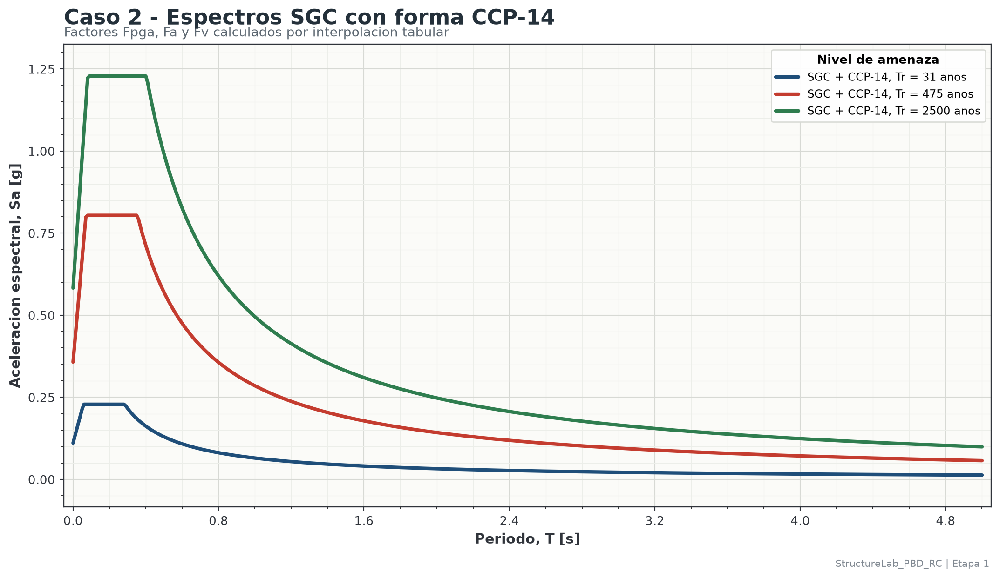
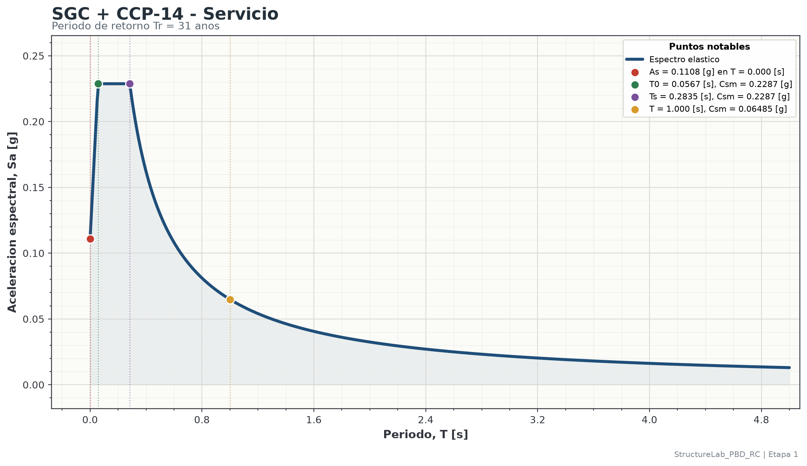
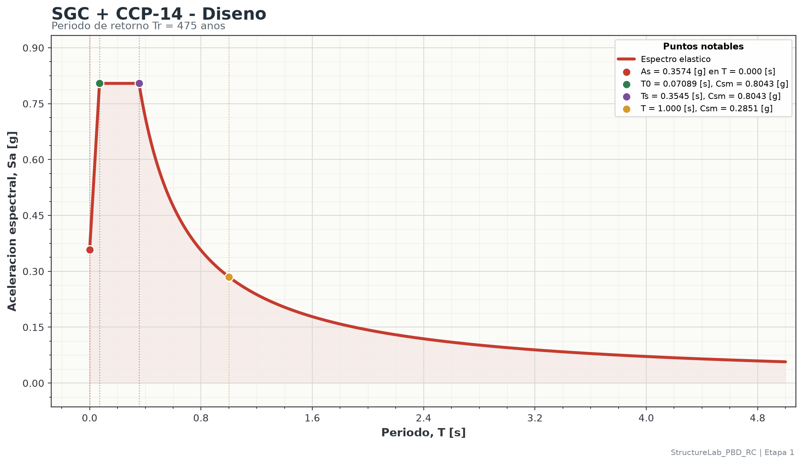
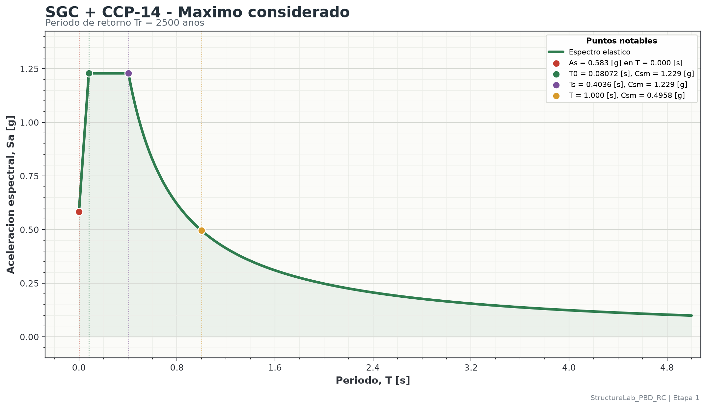

# Identificacion

Esta memoria resume los resultados de amenaza sismica de la Etapa 1. Los valores mostrados se consumen desde los resultados ya calculados por el workflow; este documento no recalcula el espectro.

| Campo | Valor |
|---|---|
| Etapa | stage_01 |
| Caso | case_02_sgc_ccp14 |
| Titulo | Espectros sismicos con datos SGC y forma espectral CCP-14 |
| Unidad de periodo | [s] |
| Unidad de aceleracion espectral | [g] |
| Rango de periodos | 0 a 5 [s], paso = 0.01 [s] |

# Datos de entrada

| Dato | Valor |
|---|---:|
| Proveedor de amenaza | Servicio Geologico Colombiano |
| Forma espectral | CCP-14 |
| Seccion de referencia | 3.10 |
| Perfil de suelo | D |
| Servicio: periodo de retorno | 31 anos |
| Servicio: PGA | 0.0692504 [g] |
| Servicio: Sa(0.2 s) | 0.142948 [g] |
| Servicio: Sa(1.0 s) | 0.0270193 [g] |
| Diseno: periodo de retorno | 475 anos |
| Diseno: PGA | 0.295782 [g] |
| Diseno: Sa(0.2 s) | 0.614901 [g] |
| Diseno: Sa(1.0 s) | 0.123673 [g] |
| Maximo considerado: periodo de retorno | 2500 anos |
| Maximo considerado: PGA | 0.582956 [g] |
| Maximo considerado: Sa(0.2 s) | 1.20841 [g] |
| Maximo considerado: Sa(1.0 s) | 0.265207 [g] |

# Ecuaciones usadas

$$
A_s = F_{pga}PGA
\qquad
S_{DS}=F_aS_s
\qquad
S_{D1}=F_vS_1
$$

$$
T_s = \frac{S_{D1}}{S_{DS}}
\qquad
T_0 = 0.2T_s
$$

$$
C_{sm}(T)=
\begin{cases}
A_s + (S_{DS}-A_s)\dfrac{T}{T_0}, & 0 \leq T < T_0 \\
S_{DS}, & T_0 \leq T \leq T_s \\
\dfrac{S_{D1}}{T}, & T > T_s
\end{cases}
$$

# Parametros calculados

| Tr [anos] | Fpga | Fa | Fv | As [g] | SDS [g] | SD1 [g] | T0 [s] | Ts [s] |
|---:|---:|---:|---:|---:|---:|---:|---:|---:|
| 31 | 1.6 | 1.6 | 2.4 | 0.110801 | 0.228717 | 0.0648464 | 0.0567046 | 0.283523 |
| 475 | 1.20844 | 1.30808 | 2.30531 | 0.357434 | 0.804339 | 0.285104 | 0.0708915 | 0.354457 |
| 2500 | 1 | 1.01664 | 1.86959 | 0.582956 | 1.22851 | 0.495827 | 0.0807199 | 0.403599 |

# Resumen de espectros

| Nivel | Tr [anos] | Sa(T=0) [g] | Sa(T=1.0 s) [g] | Sa maxima [g] | T en Sa maxima [s] |
|---|---:|---:|---:|---:|---:|
| Servicio | 31 | 0.110801 | 0.0648464 | 0.228717 | 0.06 |
| Diseno | 475 | 0.357434 | 0.285104 | 0.804339 | 0.08 |
| Maximo considerado | 2500 | 0.582956 | 0.495827 | 1.22851 | 0.09 |

# Figuras

{width=100%}

{width=100%}

{width=100%}

{width=100%}

# Archivos para ETABS v22

Los archivos TXT se exportan sin encabezado y con dos columnas por linea: periodo `T` y aceleracion espectral `Sa`.
En ETABS v22 deben importarse como `From File`, con `Values are = Period vs Value` y `Header Lines to Skip = 0`.

| Nivel | Archivo |
|---|---|
| Servicio | `outputs\stage_01\ccp14_spectra\data\etabs\case_02_sgc_ccp14_service_31_etabs_v22.txt` |
| Diseno | `outputs\stage_01\ccp14_spectra\data\etabs\case_02_sgc_ccp14_design_475_etabs_v22.txt` |
| Maximo considerado | `outputs\stage_01\ccp14_spectra\data\etabs\case_02_sgc_ccp14_maximum_considered_2500_etabs_v22.txt` |

# Archivos asociados

- YAML del caso: `outputs\stage_01\ccp14_spectra\reports\case_02_sgc_ccp14_report.yaml`
- CSV de espectros: `outputs\stage_01\ccp14_spectra\data\case_02_sgc_ccp14_spectra.csv`
- XLSX de espectros: `outputs\stage_01\ccp14_spectra\data\case_02_sgc_ccp14_spectra.xlsx`
