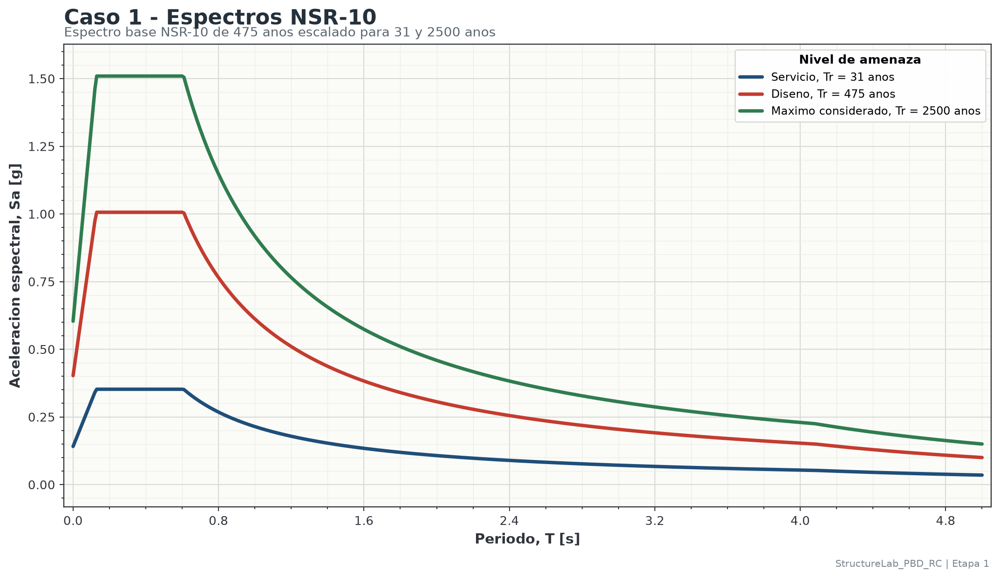
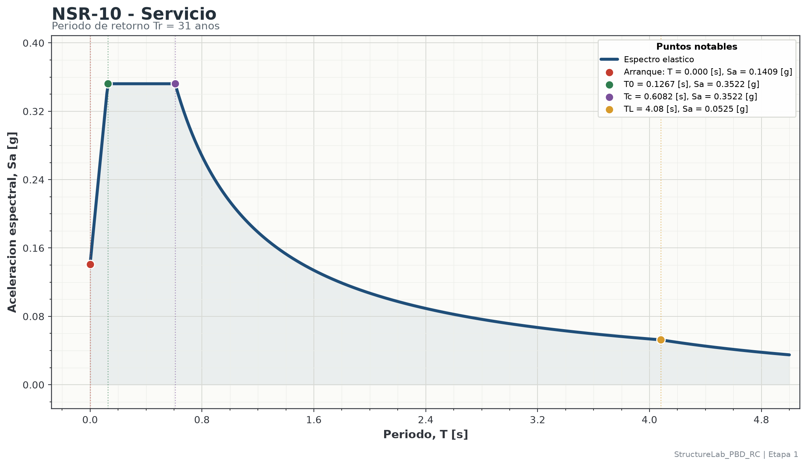
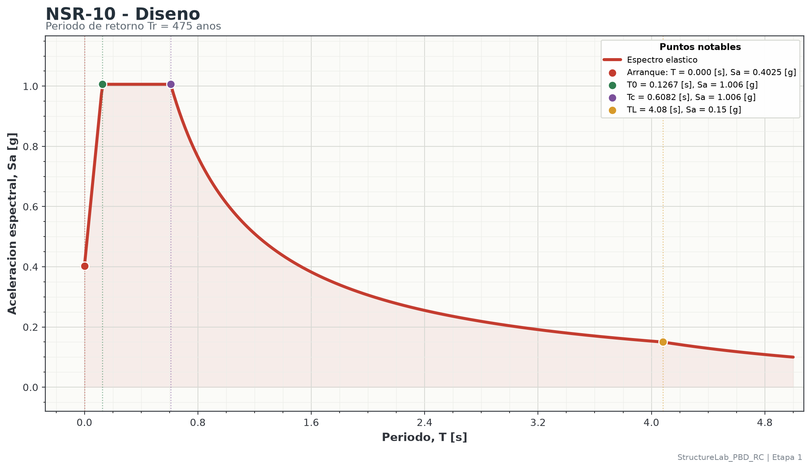
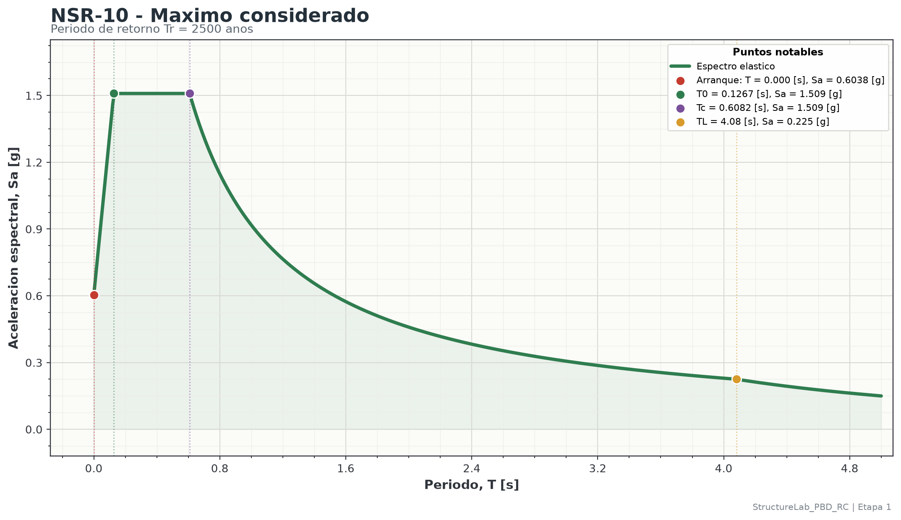

# Identificacion

Esta memoria resume los resultados de amenaza sismica de la Etapa 1. Los valores mostrados se consumen desde los resultados ya calculados por el workflow; este documento no recalcula el espectro.

| Campo | Valor |
|---|---|
| Etapa | stage_01 |
| Caso | case_01_nsr10 |
| Titulo | Espectros sismicos NSR-10 escalados por nivel de amenaza |
| Unidad de periodo | [s] |
| Unidad de aceleracion espectral | [g] |
| Rango de periodos | 0 a 5 [s], paso = 0.01 [s] |

# Datos de entrada

| Dato | Valor |
|---|---:|
| Codigo fuente | NSR-10 |
| Descripcion | Espectro elastico de aceleraciones de diseno, Titulo A, forma A.2.6. |
| Perfil de suelo | D |
| $A_a$ | 0.35 |
| $A_v$ | 0.3 |
| $F_a$ | 1.15 |
| $F_v$ | 1.7 |
| $I$ | 1 |
| Factor servicio, Tr = 31 anos | 0.35 |
| Factor diseno, Tr = 475 anos | 1 |
| Factor maximo considerado, Tr = 2500 anos | 1.5 |

# Ecuaciones usadas

$$
T_0 = 0.1\frac{A_vF_v}{A_aF_a}
\qquad
T_C = 0.48\frac{A_vF_v}{A_aF_a}
\qquad
T_L = 2.4F_v
$$

$$
S_a(T)=
\begin{cases}
2.5A_aF_aI\left(0.4+0.6\dfrac{T}{T_0}\right), & 0 \leq T < T_0 \\
2.5A_aF_aI, & T_0 \leq T \leq T_C \\
\dfrac{1.2A_vF_vI}{T}, & T_C < T \leq T_L \\
\dfrac{1.2A_vF_vT_LI}{T^2}, & T > T_L
\end{cases}
$$

# Parametros calculados

| Parametro | Valor | Ecuacion |
|---|---:|---|
| $T_0$ | 0.126708 [s] | $0.1 A_v F_v/(A_a F_a)$ |
| $T_C$ | 0.608199 [s] | $0.48 A_v F_v/(A_a F_a)$ |
| $T_L$ | 4.08 [s] | $2.4 F_v$ |
| Meseta | 1.00625 [g] | $2.5 A_a F_a I$ |

# Resumen de espectros

| Nivel | Tr [anos] | Sa(T=0) [g] | Sa(T=1.0 s) [g] | Sa maxima [g] | T en Sa maxima [s] |
|---|---:|---:|---:|---:|---:|
| Servicio | 31 | 0.140875 | 0.2142 | 0.352187 | 0.13 |
| Diseno | 475 | 0.4025 | 0.612 | 1.00625 | 0.13 |
| Maximo considerado | 2500 | 0.60375 | 0.918 | 1.50937 | 0.13 |

# Figuras

{width=100%}

{width=100%}

{width=100%}

{width=100%}

# Archivos para ETABS v22

Los archivos TXT se exportan sin encabezado y con dos columnas por linea: periodo `T` y aceleracion espectral `Sa`.
En ETABS v22 deben importarse como `From File`, con `Values are = Period vs Value` y `Header Lines to Skip = 0`.

| Nivel | Archivo |
|---|---|
| Servicio | `outputs\stage_01\nsr10_spectra\data\etabs\case_01_nsr10_service_31_etabs_v22.txt` |
| Diseno | `outputs\stage_01\nsr10_spectra\data\etabs\case_01_nsr10_design_475_etabs_v22.txt` |
| Maximo considerado | `outputs\stage_01\nsr10_spectra\data\etabs\case_01_nsr10_maximum_considered_2500_etabs_v22.txt` |

# Archivos asociados

- YAML del caso: `outputs\stage_01\nsr10_spectra\reports\case_01_nsr10_report.yaml`
- CSV de espectros: `outputs\stage_01\nsr10_spectra\data\case_01_nsr10_spectra.csv`
- XLSX de espectros: `outputs\stage_01\nsr10_spectra\data\case_01_nsr10_spectra.xlsx`
