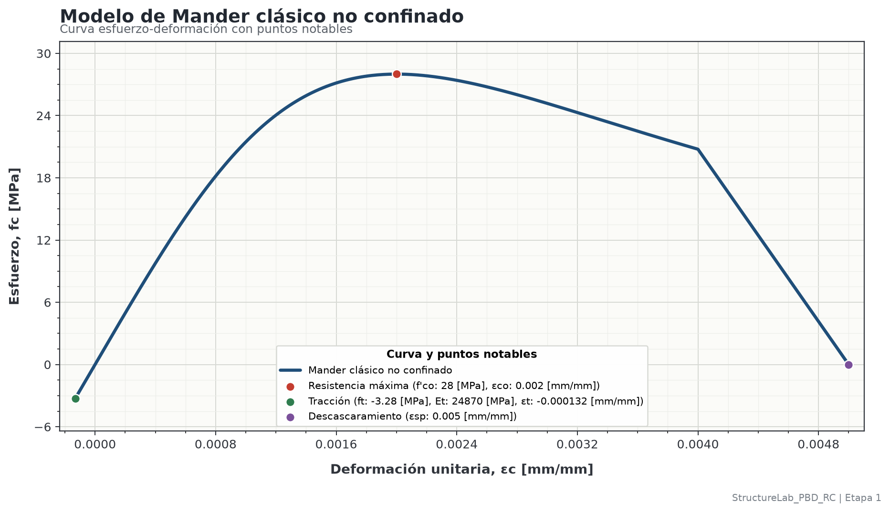

# Identificación

Esta memoria resume el modelo constitutivo de Mander clásico para concreto no confinado usado en la Etapa 1.
Los valores mostrados se consumen desde el archivo YAML del modelo ya calculado; esta memoria no recalcula parámetros.

- **Etapa:** Etapa 1.
- **Nombre de la etapa:** Caracterización mecánica monotónica de materiales.
- **Modelo constitutivo:** Mander clásico no confinado.
- **Fuente de datos:** archivo YAML de resultados del modelo.

# Datos de entrada

| Descripción | Símbolo | Valor |
|---|---:|---:|
| Resistencia máxima del concreto no confinado | $f'_{co}$ | 28 [MPa] |
| Expresión del esfuerzo último a tracción | $f_t$ | $0.62\sqrt{f'_{co}}$ |
| Módulo elástico usado en tracción | $E_t$ | $E_t = E_c$ |
| Expresión de la deformación de tracción | $\varepsilon_t$ | $\varepsilon_t = f_t/E_t$ |
| Deformación asociada a la resistencia máxima | $\varepsilon_{co}$ | 0.002 [mm/mm] |
| Deformación de descascaramiento | $\varepsilon_{sp}$ | 0.005 [mm/mm] |

# Datos de salida

| Descripción | Símbolo | Valor | Ecuación |
|---|---:|---:|---|
| Resistencia máxima del concreto no confinado | $f'_{co}$ | 28 [MPa] | - |
| Módulo elástico del concreto | $E_c$ | 24870.1 [MPa] | $4700\sqrt{f'_{co}}$ |
| Esfuerzo último a tracción del concreto | $f_t$ | 3.28073 [MPa] | $0.62\sqrt{f'_{co}}$ |
| Módulo elástico en tracción | $E_t$ | 24870.1 [MPa] | $E_t = E_c$ |
| Deformación de tracción | $\varepsilon_t$ | 0.000131915 [mm/mm] | $f_t/E_t$ |
| Deformación en la resistencia máxima | $\varepsilon_{co}$ | 0.002 [mm/mm] | - |
| Límite de la rama curva de compresión | $2\varepsilon_{co}$ | 0.004 [mm/mm] | $2\varepsilon_{co}$ |
| Deformación de descascaramiento | $\varepsilon_{sp}$ | 0.005 [mm/mm] | - |
| Módulo secante | $E_{sec}$ | 14000 [MPa] | $f'_{co}/\varepsilon_{co}$ |
| Parámetro de forma de Mander | $r$ | 2.28794 [-] | $E_c/(E_c-E_{sec})$ |

Los parámetros principales quedan:

$$
E_c = 4700 \sqrt{f'_{co}} = 24870.1\ \text{MPa}
$$

$$
f_t = 0.62 \sqrt{f'_{co}} = 3.28073\ \text{MPa}
$$

$$
E_{sec} = \frac{f'_{co}}{\varepsilon_{co}}
= \frac{28}{0.002}
= 14000\ \text{MPa}
$$

$$
r = \frac{E_c}{E_c - E_{sec}}
= \frac{24870.1}{24870.1 - 14000}
= 2.28794
$$

# Función constitutiva

Se usa compresión positiva y, para la rama de tracción del concreto, deformación y esfuerzo negativos.
La variable independiente es $\varepsilon_c$ y el esfuerzo resultante es $f_c$.

Definiendo:

$x = \dfrac{\varepsilon_c}{\varepsilon_{co}}$

la rama ascendente de Mander se expresa como:

$f_c = f'_{co}\dfrac{x r}{r - 1 + x^r}$

Con los valores del modelo:

$f_c = 28\dfrac{(\varepsilon_c/0.002)(2.28794)}{2.28794 - 1 + (\varepsilon_c/0.002)^{2.28794}}$

La función usada para graficar queda definida por las siguientes ramas:

**Rama de tracción.**

Rango: $-0.000131915 \leq \varepsilon_c < 0$

$$
f_c = 24870.1\,\varepsilon_c
$$

**Rama ascendente de compresión.**

Rango: $0 \leq \varepsilon_c \leq 0.004$

$$
f_c = 28\dfrac{(\varepsilon_c/0.002)(2.28794)}{2.28794 - 1 + (\varepsilon_c/0.002)^{2.28794}}
$$

**Rama descendente hasta descascaramiento.**

Rango: $0.004 < \varepsilon_c \leq 0.005$

$$
f_c = 20.7606\dfrac{0.005 - \varepsilon_c}{0.005 - 0.004}
$$

**Rama posterior al descascaramiento.**

Rango: $\varepsilon_c > 0.005$

$$
f_c = 0
$$

En forma compacta:

$$
f_c(\varepsilon_c) =
\begin{cases}
24870.1\,\varepsilon_c,& -0.000131915 \leq \varepsilon_c < 0 \\
28\dfrac{(\varepsilon_c/0.002)(2.28794)}{2.28794 - 1 + (\varepsilon_c/0.002)^{2.28794}},& 0 \leq \varepsilon_c \leq 0.004 \\
20.7606\dfrac{0.005 - \varepsilon_c}{0.005 - 0.004},& 0.004 < \varepsilon_c \leq 0.005 \\
0, & \varepsilon_c > 0.005
\end{cases}
$$

donde:

$$
\varepsilon_t = \frac{f_t}{E_t}
= \frac{3.28073}{24870.1}
= 0.000131915
$$

$$
2\varepsilon_{co} = 0.004
\qquad
\varepsilon_{sp} = 0.005
$$

# Curva generada

{width=100%}

# Archivos asociados

- Archivo de entrada: `configs/stages/stage_01_material_characterization.yaml`
- Archivo de resultados del modelo: `outputs/stage_01/reports/mander_classic_unconfined_concrete/mander_classic_unconfined_concrete.yaml`
- Datos de la curva en formatos CSV y XLSX: `outputs/stage_01/data/models/mander_classic_unconfined_concrete/`
- Figura de la curva: `outputs/stage_01/figures/models/mander_classic_unconfined_concrete.png`
